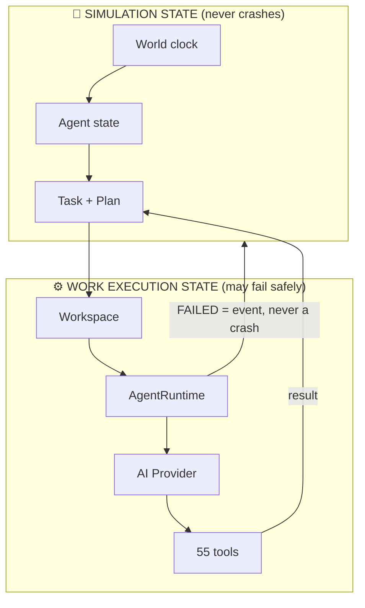

# AgentWorld 👑

<pre align="center">
██╗  ██╗██╗███╗   ██╗ ██████╗     ██╗    ██╗ ██████╗ ██████╗ ██╗     ██████╗
██║ ██╔╝██║████╗  ██║██╔════╝     ██║    ██║██╔═══██╗██╔══██╗██║     ██╔══██╗
█████╔╝ ██║██╔██╗ ██║██║  ███╗    ██║ █╗ ██║██║   ██║██████╔╝██║     ██║  ██║
██╔═██╗ ██║██║╚██╗██║██║   ██║    ██║███╗██║██║   ██║██╔══██╗██║     ██║  ██║
██║  ██╗██║██║ ╚████║╚██████╔╝    ╚███╔███╔╝╚██████╔╝██║  ██║███████╗██████╔╝
╚═╝  ╚═╝╚═╝╚═╝  ╚═══╝ ╚═════╝      ╚══╝╚══╝  ╚═════╝╚═╝  ╚═╝╚══════╝╚═════╝
</pre>

<p align="center">
  <b>A simulated digital company where AI agents hold jobs, money, identities,
  memories — and answer for what they do.</b>
</p>

<!-- check-docs: models=38 tools=55 packages=19 -->

<p align="center">
  
  
  
  
  
  
</p>

---

## 🌍 The world in one picture



> **The one rule everything obeys:** the simulation may know an agent is
> `WORKING`, but real work runs through the Workspace/Runtime layer. If the
> runtime fails, the task becomes `FAILED`/`BLOCKED` per policy, the failure
> becomes an event, and the agent stays available for recovery. **A workspace
> failure never crashes the world.**

---

## ⚡ Quick start — from zero to a living company in 60 seconds

```bash
npm install
cp .env.example .env          # works as-is — no API keys needed
npm run db:generate && npm run db:migrate && npm run db:seed
npm run dev                   # API on :4000
npm run dev:web               # Dashboard on :5173
```

Then meet **Ahmad** (the Planner) and **Rashid** (the Executor) — two seeded
agents with real wallets, memories, jobs, and a pending approval waiting for
you on the dashboard. Talk to one. Watch it plan, delegate, spend, and report.

Runs end to end with **zero API keys** via the deterministic `mock` provider.
Plug in a real vendor only when you want real model reasoning — switching is a
database `UPDATE`, never a deployment.

---

## 💰 Money with seven locks

Every cent is integer minor units (`Money` value object — floats are banned).
The ledger is the **only** writer of balances, and it guarantees:

| # | Guarantee | How |
|---|-----------|-----|
| 1 | **Atomicity** | balance update + `Transaction` append in one DB transaction |
| 2 | **No overdraft** | a debit below zero is refused |
| 3 | **Double entry** | DEBIT + CREDIT legs share a `transferGroupId` |
| 4 | **Idempotency** | `idempotencyKey` turns a retry into a no-op (unique index) |
| 5 | **Immutability** | SQLite triggers abort any `UPDATE`/`DELETE` on `Transaction` |
| 6 | **Optimistic locking** | each write asserts the wallet `version` — no double-spend |
| 7 | **Deadlock-free** | two-wallet ops sort wallet ids before touching them |

`verifyLedger()` replays the whole ledger and proves every balance equals the
sum of its entries. The finance suite tests all seven — including concurrent
double-spend races and trigger-tampering attempts.

---

## 🤖 Agents that can only act through tools

```
human message ──▶ wakeup ──▶ THINKING ──▶ act (tools) ──▶ observe ──▶ reply ──▶ IDLE
                                       │         │
                                       │         ▼
                                       │    ┌──────────┐
                                       └───▶│ DENIED?  │──▶ recorded, loop continues
                                            │ APPROVAL?│──▶ frozen, human decides, replayed once
                                            └──────────┘
```

- The runtime holds **no database handle** — its only capability is the
  injected `ToolInvoker`. There is no code path from a tool call to a handler
  that skips permission → Zod → approval → audit.
- Behaviour comes from `roleKey → RoleProfile`, **never** from a name. There
  is no `if (agent.name === ...)` anywhere in the repository.
- The registry **refuses to load** any role granting a human-only permission —
  that is the structural reason an agent cannot approve its own spend.
- Recipients are addressed **by role** (`message.send({to: "EXECUTOR"})`), so
  replacing an agent never breaks caller logic.
- Every run writes episodic + fact + obligation memories, so the next turn
  has continuity — and pending approvals are remembered, not retried.

**55 tools** across tasks, messages, memory, wallets, world, company, events,
approvals, plans, reviews, reports, escalations, sessions, workspaces, files,
terminal, git, executions, and skills.

---

## 🗺️ Where things are

| Area | What lives there |
|------|------------------|
| `apps/api` | Express REST (`/api/v1`): JWT auth, RBAC, approval replay, agent wakeup, simulation control + SSE stream |
| `apps/web` | React + Tailwind operator dashboard — World, Simulation (three.js), Company, Agents, Tasks, Communication, Economy, Approvals, Plans, Sessions, Workspaces, Executions, Escalations, Skills, Activity |
| `packages/{shared,database,security}` | enums, `Money`, errors, config, JWT, RBAC, rate limits, sanitisation |
| `packages/{economy,events,tasks,memory,world,company}` | ledger, event bus + audit, state machines, decay-ranked memory, dual clock |
| `packages/{agents,orchestration,runtime}` | runtime loop, roles, capabilities, hierarchy, plans, delegation, reviews + rework budgets, reports, escalations, sessions |
| `packages/{ai,tools}` | provider abstraction + `ModelRouter`, 34-tool registry + single enforcement point |
| `packages/simulation` | needs, skills, goals, activities, deterministic decision engine, world tick loop |
| `packages/workspace` | Phase 3 work environments — closed-root path guard, workspace lifecycle, members, file browsing, archive/reap |
| `packages/execution` | Phase 3 execution runtime — `ExecutionBackend` (mock/local/OpenCode), guarded idempotent queue, non-blocking worker, spooled output, orphan recovery, verification pipeline |
| `packages/skills` | external skill manifests — trust, security analysis, prompt-injection screening, installer, lockfile |
| `database/` | Prisma SQLite schema (38 models) + migrations + idempotent `seed.ts` |
| `tests/` | 18 suites, **170+ tests** — finance races, ledger proofs, review loops, permissions, API, simulation, path escapes, queue/worker, backends |
| `docs/` | `ARCHITECTURE` · `SIMULATION_ENGINE` · `SECURITY` · `API` · `ROADMAP` · `AGENTWORLD_PHASE_3_ARCHITECTURE` · `PHASE3-AUDIT` |

---

## 🧭 Phases

| Phase | Scope | Status |
|-------|-------|--------|
| **1 — Core engine** | ledger, events, providers, tasks, memory, world, runtime, tools, approvals, API, seed, dashboard | ✅ complete |
| **2 — Orchestration** | plans, delegation, capabilities, hierarchy, reviews + rework, reports, escalations, sessions, simulation engine, `ModelRouter` | ✅ complete |
| **3 — Real workspace** | `AgentWorkspace`, process isolation, `terminal`/`fs`/`git` tools, `OpenCodeAdapter`, verification pipeline, live UI, 3D link | 🔨 [in progress](docs/PHASE3-AUDIT.md) |

---

## ✅ Verify everything with one command

```bash
npm run verify   # typecheck → lint → test → build
```

Plus a taste of the API:

```bash
curl -X POST localhost:4000/api/v1/simulation/start -H "Authorization: Bearer $TOKEN"
curl        localhost:4000/api/v1/simulation/state -H "Authorization: Bearer $TOKEN"
curl -N     "localhost:4000/api/v1/events/stream?token=$TOKEN"
```

See [`plan.md`](plan.md) for the session handover record and [`docs/`](docs/) for
the full story. The company is open for business. 👑
