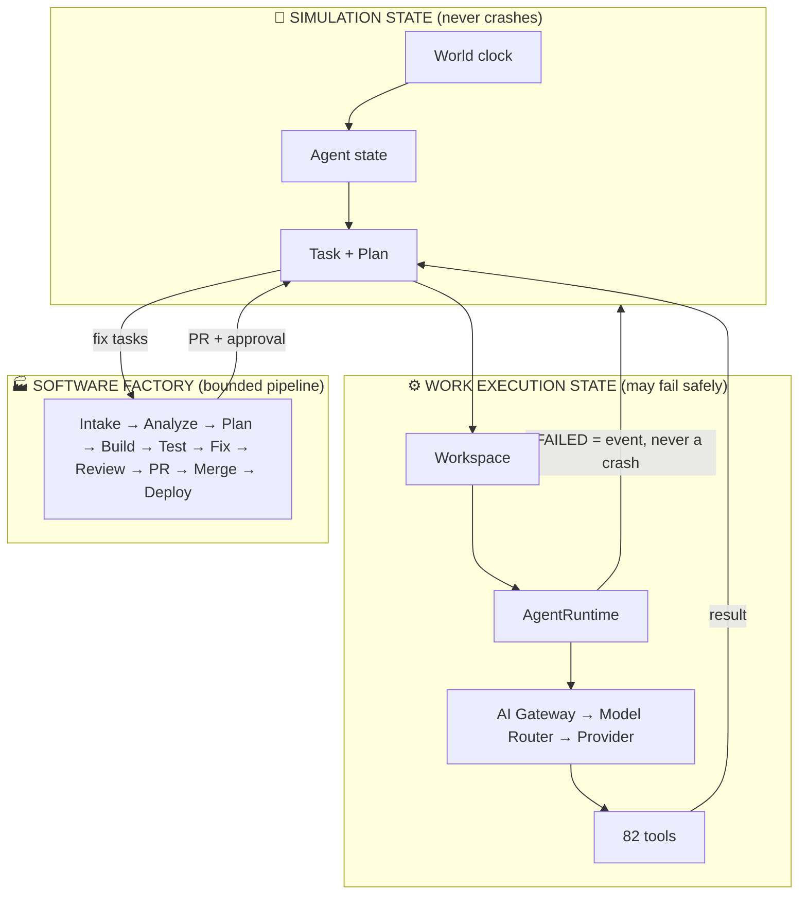

# AgentWorld 👑

<pre align="center">
██╗  ██╗██╗███╗   ██╗ ██████╗     ██╗    ██╗ ██████╗ ██████╗ ██╗     ██████╗
██║ ██╔╝██║████╗  ██║██╔════╝     ██║    ██║██╔═══██╗██╔══██╗██║     ██╔══██╗
█████╔╝ ██║██╔██╗ ██║██║  ███╗    ██║ █╗ ██║██║   ██║██████╔╝██║     ██║  ██║
██╔═██╗ ██║██║╚██╗██║██║   ██║    ██║███╗██║██║   ██║██╔══██╗██║     ██║  ██║
██║  ██╗██║██║ ╚████║╚██████╔╝    ╚███╔███╔╝╚██████╔╝██║  ██║███████╗██████╔╝
╚═╝  ╚═╝╚═╝╚═╝  ╚═══╝ ╚═════╝      ╚══╝╚══╝  ╚═════╝╚═╝  ╚═╝╚══════╝╚═════╝
</pre>

<p align="center">
  <b>A simulated digital company where AI agents hold jobs, money, identities,
  memories — and answer for what they do. Plus a real AI platform and a real
  Software Factory that ships code through it.</b>
</p>

<p align="center">
  
  
  
  
  
  
  
</p>

---

## 🌍 The world in one picture



> **The one rule everything obeys:** the simulation may know an agent is
> `WORKING`, but real work runs through the Workspace/Runtime layer. If the
> runtime fails, the task becomes `FAILED`/`BLOCKED` per policy, the failure
> becomes an event, and the agent stays available for recovery. **A workspace
> failure never crashes the world.** The factory obeys the same rule: a failed
> stage is evidence, never an exception.

---

## 🚀 Run it — from clone to a living company

Prerequisites: **Node 20.11+** (22 recommended), **npm**, **git**. Nothing
else — no Docker, no Postgres, no API keys. Storage is SQLite, models run on
the deterministic `mock` provider, so the whole loop works offline.

```bash
# 1. Install and configure (Windows: use `copy` instead of `cp`)
npm install
cp .env.example .env          # works as-is — no keys needed

# 2. Let the doctor check your machine (node version, env, client, DB)
npm run doctor

# 3. Generate the database client
npm run db:generate

# 4. Build the database from the migration SQL, in order.
#    (The Prisma CLI hangs in this repo — never call `prisma migrate`
#    directly; execute the SQL through the query engine instead.)
#    macOS / Linux:
for d in database/migrations/*/; do
  npx tsx scripts/apply-migration.ts "$(basename "$d")"
done
#    Windows PowerShell:
Get-ChildItem database/migrations -Directory -Name |
  Where-Object { $_ -notlike "*.toml" } | Sort-Object |
  ForEach-Object { .\node_modules\.bin\tsx.cmd scripts/apply-migration.ts $_ }

# 5. Seed the world (owner account, company, Ahmad + Rashid, wallets)
npm run db:seed

# 6. Start the API (terminal 1) and the dashboard (terminal 2)
npm run dev                   # API on http://localhost:4000
npm run dev:web               # Dashboard on http://localhost:5173
```

Then open the dashboard and sign in with the seeded owner account:

| Field | Default (from `.env.example`) |
|-------|-------------------------------|
| Email | `king@kingworld.local` |
| Password | `KingWorld!2026` |

(Change both via `SEED_OWNER_*` before any shared/production use. In
production `JWT_SECRET` must also be replaced — the server refuses to boot
otherwise.)

**Your first five minutes.** Meet **Ahmad** (the Planner) and **Rashid**
(the Executor) — two seeded agents with real wallets, memories, jobs, and a
pending approval waiting for you. Talk to one in *Communication*. Watch it
plan, delegate, spend, and report. Then open the *Factory* tab, paste any
public GitHub URL, and advance the run stage by stage: analyze → plan →
build → test → review → PR → approve → merge. Plug in a real vendor only
when you want real model reasoning — `GET /integrations/providers` shows all
20 catalogued vendors and exactly which env change enables each one.
Switching is a database `UPDATE`, never a deployment.

**Everyday commands.**

| Command | What it does |
|---------|--------------|
| `npm run verify` | the one command to trust: typecheck → lint → test → build |
| `npm run doctor` | environment health check with exact fix hints |
| `npm run check:docs` | README tool/model counts match the tree |
| `.\node_modules\.bin\vitest.cmd run <file>` | run one test file (never bare `npx` here — it hangs) |
| `npm run db:seed` | re-seed (idempotent, safe to re-run) |

**Troubleshooting.**

| Symptom | Fix |
|---------|-----|
| `prisma --version` / `prisma migrate` hangs | Expected here — use `npm run db:generate` + `scripts/apply-migration.ts`, never the CLI |
| `npx …` hangs | Call binaries directly: `.\node_modules\.bin\vitest.cmd`, `.\node_modules\.bin\tsx.cmd` |
| `EADDRINUSE :4000` / `:5173` | Another server holds the port — stop it or set `PORT=` / `VITE_API_BASE_URL=` |
| `SQLITE_BUSY` / locked DB | Stop other servers/tests; test DBs are per-process (`test-<pid>.db`), `dev.db` is yours alone |
| Want a clean database | Delete `dev.db*`, re-apply the migrations (step 4), re-seed (step 5) |
| Dashboard can't reach the API | `VITE_API_BASE_URL` defaults to `http://localhost:4000/api/v1` — set it only if the API moved |
| Path with spaces fails (Windows) | Quote it: `Set-Location -LiteralPath "alle folder von code\AgentWorld"` or pass `-workdir` explicitly |

---

## 💰 Money with seven locks

Every cent is integer minor units (`Money` value object — floats are banned).
The ledger is the **only** writer of balances, and it guarantees:

| # | Guarantee | How |
|---|-----------|-----|
| 1 | **Atomicity** | balance update + `Transaction` append in one DB transaction |
| 2 | **No overdraft** | a debit below zero is refused |
| 3 | **Double entry** | DEBIT + CREDIT legs share a `transferGroupId` |
| 4 | **Idempotency** | `idempotencyKey` turns a retry into a no-op (unique index) |
| 5 | **Immutability** | SQLite triggers abort any `UPDATE`/`DELETE` on `Transaction` |
| 6 | **Optimistic locking** | each write asserts the wallet `version` — no double-spend |
| 7 | **Deadlock-free** | two-wallet ops sort wallet ids before touching them |

`verifyLedger()` replays the whole ledger and proves every balance equals the
sum of its entries. The finance suite tests all seven — including concurrent
double-spend races and trigger-tampering attempts. AI spend crosses into this
same ledger (as `FEE`) only above a configured threshold — there is no second
money system.

---

## 🤖 Agents that can only act through tools

```
human message ──▶ wakeup ──▶ THINKING ──▶ act (tools) ──▶ observe ──▶ reply ──▶ IDLE
                                       │         │
                                       │         ▼
                                       │    ┌──────────┐
                                       └───▶│ DENIED?  │──▶ recorded, loop continues
                                            │ APPROVAL?│──▶ frozen, human decides, replayed once
                                            └──────────┘
```

- The runtime holds **no database handle** — its only capability is the
  injected `ToolInvoker`. There is no code path from a tool call to a handler
  that skips permission → Zod → approval → audit.
- Behaviour comes from `roleKey → RoleProfile`, **never** from a name. There
  is no `if (agent.name === ...)` anywhere in the repository.
- The registry **refuses to load** any role granting a human-only permission —
  that is the structural reason an agent cannot approve its own spend.
- Recipients are addressed **by role** (`message.send({to: "EXECUTOR"})`), so
  replacing an agent never breaks caller logic.
- Every run writes episodic + fact + obligation memories, so the next turn
  has continuity — and pending approvals are remembered, not retried.

**82 tools** behind the single `ToolExecutor` enforcement point:

| Family | Tools |
|--------|-------|
| Tasks | `task.create/update/list/detail`, dependencies |
| Communication | `message.send/read` |
| Memory | `memory.store/search/forget` |
| Economy | `wallet.balance/transfer/statement` |
| World & simulation | `world.*`, districts, locations |
| Company | `company.*` |
| Events & audit | `event.emit`, activity |
| Approvals | `approval.list/get/decide` (decide is human-only) |
| Planning & orchestration | `plan.*`, `review.submit`, `report.submit`, `agent.escalate`, `session.*` |
| Workspaces, files, terminal, git | `workspace.*`, `fs.*`, `terminal.*`, `git.*` |
| Execution | `execution.create/get/list/cancel` |
| AI platform | `provider.list/complete/usage`, `connector.list/get/call` |
| Testing & QA | `testing.run/get/list/settle` |
| Software Factory | `factory.start/advance/get/list/project/team.suggest/failure.analyze/fix/review/deploy/merge` (`merge` is human-only) |
| Social, performance & academy | `relationship.list/peers/get/observe`, `agent.performance`, `academy.train/list`, `agent.evolution` |

---

## 🧠 AI platform — one gateway, honest vendors

```
Agent ──▶ ToolExecutor ──▶ AI Gateway ──▶ Model Router ──▶ Provider Adapter ──▶ Model
                                    │            │
                                    │            └── capability · task type · context ·
                                    │                budget · availability (cheapest wins)
                                    └── resolve · execute · bounded retry/fallback ·
                                        usage + cost + latency tracking · redaction
```

- **20 vendors catalogued as data** (`VENDOR_CATALOG`): OpenAI, Anthropic,
  Google, Mistral, Groq, Cohere, xAI, DeepSeek, OpenRouter, Together,
  Fireworks, Perplexity, Cerebras, Azure OpenAI, AWS Bedrock, Google Vertex,
  Hugging Face, Ollama, vLLM, llama.cpp. Unconfigured vendors report
  `configured: false` with the exact env change that enables them — availability
  is never faked.
- **Routing by capability, task type, context size, cost budget and
  availability.** Fallback is bounded (never infinite) and every fallback is
  recorded. No agent ever calls a provider directly.
- **One path in**: the agent runtime's *own* thinking calls go through the
  same gateway as the `provider.complete` tool — no agent dials a provider
  adapter directly. A scripted `mock` fallback is allowed only for an agent
  pinned to `mock`; a pinned real provider that fails is reported, never
  silently answered by a script.
- **Usage & cost**: every call appends an `AiUsage` row (tokens, estimated
  cost, latency, correlation ID). Above `AI_CHARGE_THRESHOLD_MINOR` the
  estimate is charged to the company treasury as a `FEE` through the one
  ledger, keyed by the usage row — a retry replays as a no-op instead of
  double-charging.
- **Secrets**: API keys and OAuth tokens live sealed in the Vault and are
  injected server-side. Agents never see credentials; CAPTCHAs, paywalls and
  provider auth are never bypassed.

---

## 🔌 Universal Connect — agents reach the outside world safely

```
Agent ──▶ ToolExecutor (connector.call) ──▶ Connector Adapter ──▶ External Service
                                                    │
                                                    └── credential resolved server-side via Vault
```

Marketplace transports: **REST** (GitHub, Slack, generic HTTP), **GraphQL**
(generic endpoint), **outbound webhooks** (SSRF-guarded, forwards no
credentials), **OAuth** (signed single-use flow), plus honestly-unavailable
bridges for CLI / database / external-MCP / WebSocket — registered with setup
notes, failing loudly instead of reaching the network. Every connector
declares version, category, capabilities, required scopes and security posture;
every call is audited.

**Webhooks**: registration, HMAC-SHA256 signatures, bounded retries with
backoff, dead-letter state, auto-disable on repeated failure, idempotent
delivery, full audit.

---

## 🏭 Software Factory — GitHub URL in, reviewed PR out

```
URL → INTAKE → ANALYZING → PLANNING → BUILDING → TESTING ⇄ FIXING
  → REVIEWING → AWAITING_APPROVAL → (human merge) → COMPLETED → DEPLOYED
```

- **Evidence belongs to its run**: the TESTING stage only reads test runs in
  its own task/workspace scope, consumes a settled verdict exactly once, and
  waits while a job is in flight. Re-advancing queues a retest rather than
  re-entering FIXING on stale evidence, and never spawns a duplicate job.
- **Repository analyzer** separates *observed facts* (tree, manifests, CI,
  docs, secrets hygiene, score) from *inferred* findings and *hypotheses*.
  LLM output is advisory and never overwrites facts.
- **Managed-project view** maps stages onto DISCOVERING…DEPLOYED with team,
  task, tests, review verdict, PR and deployments in one object.
- **Team formation** ranks agents by skills, availability, workload and
  reputation — suggestion only; assignment stays with the delegation engine.
- **Testing & QA**: UNIT, INTEGRATION, E2E, BROWSER, MOBILE, SECURITY,
  PERFORMANCE. Browser/mobile without runners record honest simulated ERROR
  rows (never passes); security runs real self-checks; performance stores
  real latencies. TesterArmy is a reserved adapter, never the only mechanism.
- **Autonomous fix loop is bounded** (attempts, runtime, model calls):
  failure analysis quotes evidence verbatim → exactly one fix task per call →
  retest. Exhaustion means FAILED/BLOCKED, never another loop.
- **Review gate** (analysis, plan, passing tests, secret hygiene, budget,
  branch) records its verdict and never opens the PR. **Merge and deploy
  respect the approval policy** — the human decides at the gate.
- **Deployment** (`vercel|docker|cloud|local|custom`): `custom` with an
  explicit workspace command executes for real through the runtime; anything
  else records BLOCKED naming the missing piece. Rollback only with a
  recorded rollback command. Success is never claimed without evidence.

See [`docs/FACTORY.md`](docs/FACTORY.md) for the full operator contract.

---

## 🌐 Public API & MCP — one security architecture

Base: `http://localhost:4000/api/v1` (JWT auth). Every endpoint has
authentication, authorization, input validation, pagination, rate limiting,
audit and consistent errors. Resources: `auth, world, companies, agents,
tasks, conversations, memories, economy, approvals, tools, logs, simulation,
events, plans, sessions, reviews, reports, escalations, conflicts,
workspaces, skills, executions, integrations, mcp, testing, factory,
relationships, performance`. Full reference: [`docs/API.md`](docs/API.md).

**MCP** (`/mcp`, JSON-RPC 2.0, `aw_`-scoped API keys): **21 tools**
(agents, companies, projects, tasks, memory, testing, world, economy,
factory, providers, models, connectors, webhooks, approvals, sessions,
workspaces, plans) and **10 resources** — all scope-checked and audited.
External agents, the dashboard and internal tools all pass the same
Auth → RBAC → ToolExecutor → Audit gauntlet. MCP never bypasses it.

---

## 🗺️ Where things are

| Area | What lives there |
|------|------------------|
| `apps/api` | Express REST (`/api/v1`, 29 route files): JWT auth, RBAC, approval replay, agent wakeup, simulation control + SSE stream |
| `apps/web` | React + Tailwind operator dashboard — Simulation (three.js), World, Company, Agents, Performance,
Tasks, Plans, Sessions, Workspaces, Executions, **Factory, Testing, Integrations**, Escalations, Skills,
Communication, Economy, Approvals, Activity |
| `packages/{shared,database,security}` | enums, `Money`, errors, config, JWT, RBAC, rate limits, sanitisation |
| `packages/{economy,events,tasks,memory,world,company}` | ledger, event bus + audit, state machines, decay-ranked memory, dual clock |
| `packages/{agents,orchestration,runtime}` | runtime loop, roles, capabilities, hierarchy, relationships, performance center, plans, delegation, reviews + rework budgets, reports, escalations, sessions |
| `packages/{ai,tools}` | provider abstraction + `ModelRouter` + vendor catalog, 82-tool registry + single enforcement point |
| `packages/{connectors,vault,webhooks,mcp}` | connector marketplace + OAuth, sealed credentials, signed deliveries, scoped MCP server |
| `packages/{factory}` | pipeline, repository analyzer, GitHub client, testing engine (7 adapters), project mapping, team suggestions, fix loop, review gate, deployment adapters |
| `packages/simulation` | needs, routines, goals, activities, deterministic decision engine, world tick loop |
| `packages/workspace` | Phase 3 work environments — closed-root path guard, workspace lifecycle, members, file browsing, archive/reap |
| `packages/execution` | Phase 3 execution runtime — `ExecutionBackend` (mock/local/OpenCode), guarded idempotent queue, non-blocking worker, spooled output, orphan recovery, verification pipeline |
| `packages/skills` | external skill manifests — trust, security analysis, prompt-injection screening, installer, lockfile |
| `database/` | Prisma SQLite schema (48 models) + migrations + idempotent `seed.ts` |
| `tests/` | 29 suites, **282 tests** (267 passing, 15 environment-gated skips when Docker/CLI runtimes are absent) — finance races, ledger proofs, review loops, permissions, API, simulation, sandbox, AI platform, factory, QA, social/academy, payroll |
| `docs/` | `ARCHITECTURE` · `SIMULATION_ENGINE` · `SECURITY` · `API` · `ROADMAP` · `FACTORY` · `AGENTWORLD_PHASE_3_ARCHITECTURE` · `PHASE3-AUDIT` |

---

## 🧭 Phases

| Phase | Scope | Status |
|-------|-------|--------|
| **1 — Core engine** | ledger, events, providers, tasks, memory, world, runtime, tools, approvals, API, seed, dashboard | ✅ complete |
| **2 — Orchestration** | plans, delegation, capabilities, hierarchy, reviews + rework, reports, escalations, sessions, simulation engine, `ModelRouter` | ✅ complete |
| **3 — Real workspace** | `AgentWorkspace`, process isolation, `terminal`/`fs`/`git` tools, `OpenCodeAdapter`, verification pipeline, live UI, 3D link | ✅ landed ([audit](docs/PHASE3-AUDIT.md)) |
| **4 — Districts** | `District` model, geometry metadata, capacity enforcement, dashboard surface | ✅ complete |
| **5 — Daily routines** | event-driven routine engine on the tick path, `ROUTINE_*` events, misses surfaced never crashing | ✅ complete |
| **6 — Social graph & reputation** | `AgentRelationship` edges from observed interactions (`relationship.*` tools + REST), reputation evolved only from measured evidence (`agent.evolution`, ≤5 points/pass, audited) | ✅ core landed |
| **Performance Center** | evidence-based agent/company performance summaries from tasks, reviews, executions and AI usage (`agent.performance` + REST + dashboard view) | ✅ core landed |
| **Academy** | `TrainingRun` lifecycle — skills granted only on a passed scored evaluation, widening requires human authority (`academy.train` + REST) | ✅ core landed |
| **Payroll heartbeat** | daily payroll on the tick path, idempotent per (company, agent, simulated day), shortfalls recorded never crashing | ✅ core landed |
| **11 — AI platform + Factory** | 20-vendor catalog, budget/context routing, connector marketplace, webhooks, MCP (21 tools/10 resources), `/api/v1` growth, testing engine (7 adapters), full factory lifecycle (analyze→plan→team→build→test→fix→review→PR→merge→deploy), Factory/Testing/Integrations dashboard | ✅ complete ([contract](docs/FACTORY.md)) |

---

## ✅ Verify everything with one command

```bash
npm run verify   # typecheck → lint → test → build
npm run check:docs  # README tool/model counts match the tree
```

Plus a taste of the API:

```bash
curl -X POST localhost:4000/api/v1/simulation/start -H "Authorization: Bearer $TOKEN"
curl        localhost:4000/api/v1/simulation/state -H "Authorization: Bearer $TOKEN"
curl        localhost:4000/api/v1/factory/runs -H "Authorization: Bearer $TOKEN"
curl        localhost:4000/api/v1/integrations/providers -H "Authorization: Bearer $TOKEN"
curl -N     "localhost:4000/api/v1/events/stream?token=$TOKEN"
```

See [`plan.md`](plan.md) for the session handover record and [`docs/`](docs/) for
the full story. The company is open for business. 👑
